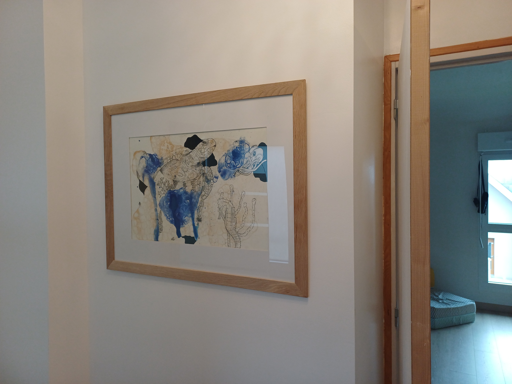
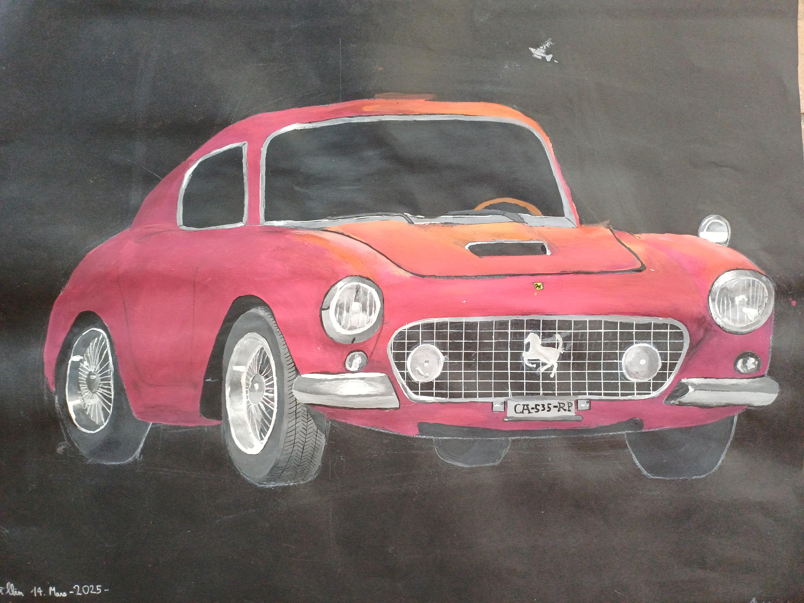
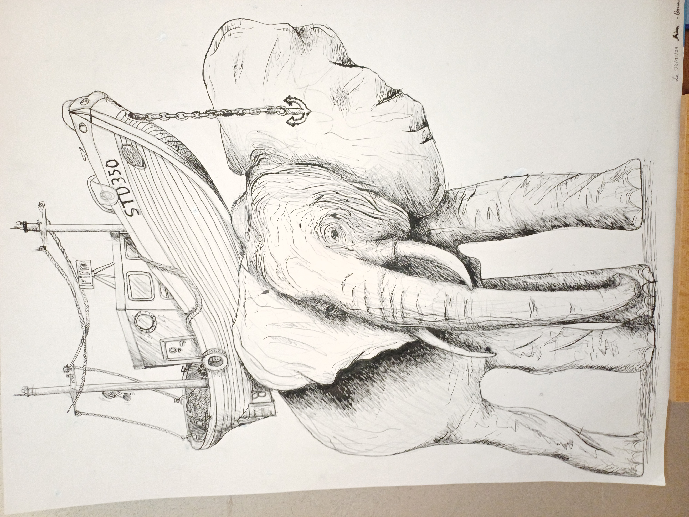
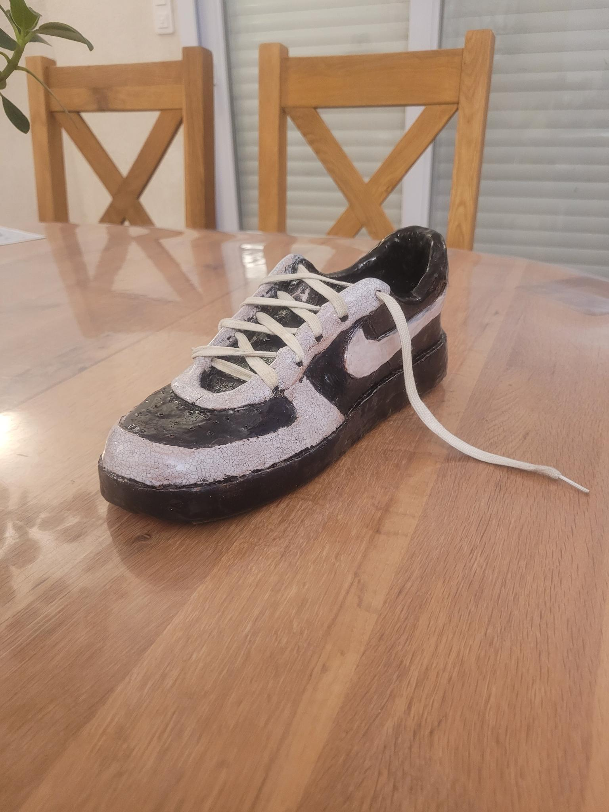
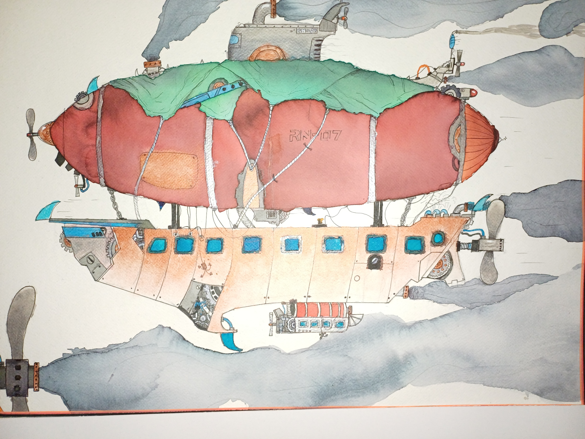

# BOOK Albin BOSSARD

## Qui suis-je ?

Je suis né en 2009 à Rennes et actuellement lyceen au lycée Ozanam à Cesson-Sévigné.
Je suis passionné de dessin et création -art plastique (+10 années). Voici le book de mes principales réalisations et experiences que j'ai réalisées :

## Réalisations

### Monstres issu de formes aléatoires.

**Techniques** : On a pris une truelle et on a tracé des formes au hasard avec de la gouache sur le papier.
Avec les 3 taches différentes que j'avais obtenu j'ai décidé de former une scène complète en ajoutant les détails
nécessaires pour leur donner vie : yeux et dents pour le monstre, structure métallique pour le robot et enfin contour de 
soucoupe spatiale pour l'extraterrestre en bas à gauche.

### Reprise d'une oeuvre de Hokusai

**Techniques** : J'ai décidé de refaire une petite partie d'une oeuvre de Hokusai et de lui ajouter des détails car c'était un zoom sur l'oeuvre.
La lune a étée faite au stylo, le reste des couleurs sont de la gouache et du posca.

Date de réalisation : 10 avril 2026

### Tortue de mer

**Techniques** : croquis au crayon de papier puis repassage à la plume et application
de gouache mélangé à du produit vaisselle pour créer des bulles que l'ont laisse éclater
pour créer les effets.

### Ferrari vintage

**Techniques** : croquis au crayon de papier puis gouache et stylo blanc.

Date de réalisation : 14 mars 2025

### Éléphant portant un bateau sur son dos

**Techniques** : Esquisse au crayon de papier puis repassage à la plume.

Date de réalisation : 2 décembre 2024

### Chaussure en poterie

**Techniques** : Réalisation de la base en terre rembourrée avec du papier journal
puis détails avec des outils précis, perçage de trous pour les lacets et enfin peinture
puis cuisson à 1800 degrés !

Date de réalisation : 2023

### Antilope

Fond de l'oeuvre avec peinture épaisse (cire + gouache) puis esquisse au crayon de papier et ajout par 
mini touche de peinceau de la fourure de l'animal puis détails avec mini peinceau.

### Steampunk zeppelin

Traits principaux au crayon de papier puis repassage au stylo noir et ajout d'encre qui permet de créer cet effet steampunk avec 
les variations de couleur.

Date de réalisation : 2023 

### Projets collaboratifs

J'ai postulé pour rejoindre l'association FF musique et son projet de jeux.
Cela me permet de créer des objets 3D qui auront une utilité pour un ajout futur dans le jeu.
TODO: METTRE IMAGE PORTE => non car secret pas le droit
<https://www.jeveuxaider.gouv.fr/>

## Stages en entreprise

- **Stage chez Hiboost :**

Mon stage de 3ème a été réalisé chez l'entreprise Hiboost ( <https://www.hiboost.fr/> )

J'ai assité aux réunions du matin qui donnent les principaux objectifs de la journée et rappellent les exigences de l'entreprise qui les a contacté.
J'ai pu voir le déroulement de 3 journées de projet de la création UI/UX au code et
passer du temps pour observer les différents métiers présents : 

UI/UX : Il travaille sur un logiciel qui permet d'avoir une preview de toutes les
pages du site et travaille surtout sur son design et animation et enfin l'ergonomie.

Développeur Web : Son travail consiste à faire la structure du site et faire fonctionner 
toute la partie design.

- **Stage chez Vivement Lundi :**

Studio d'animation- dessin animés basé a Rennes j'y ai passé 1 semaine pendant laquelle les employés me présentent leur différents métiers 
On m'a donc confié plusieurs taches qui étaient simples mais leur faisaient gagner du temps. 

Tout d'abord sur Photoshop : je devais recadrer certaines images et les mettre dans des cadres et enfin placer un carré sur les différents personnages. 

J'ai ausssi eu le temps de regarder plusieurs tutoriels blender car pour dessiner certaines scènes il fallait des perspectives déja calculées par
Blender et vu qu'ils n'avaient pas beaucoup d'expérience en 3D cela avait l'air de les aider ( <https://www.vivement-lundi.com/> )

**Stage chez Orange :**

